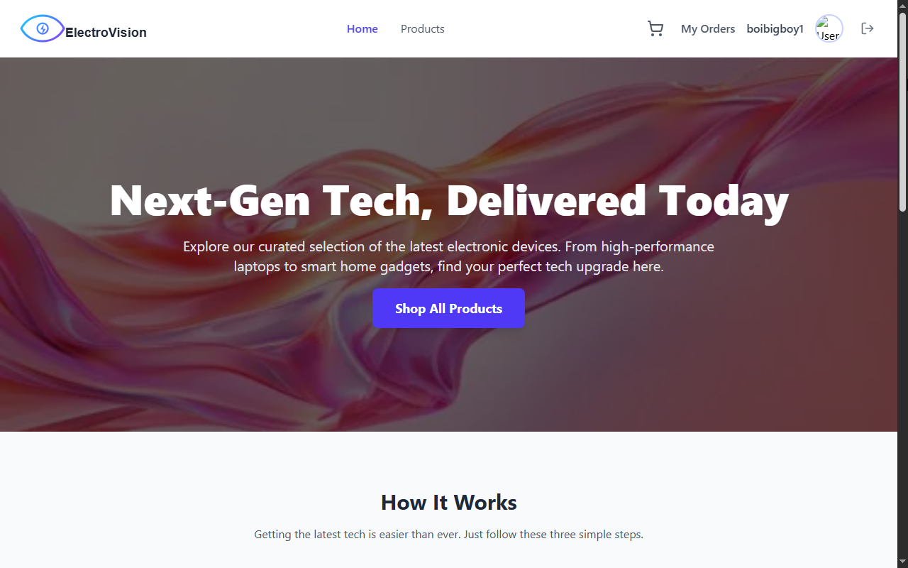
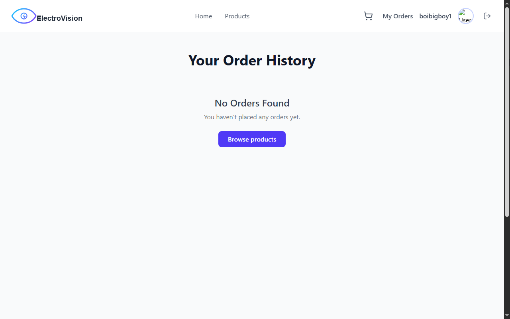
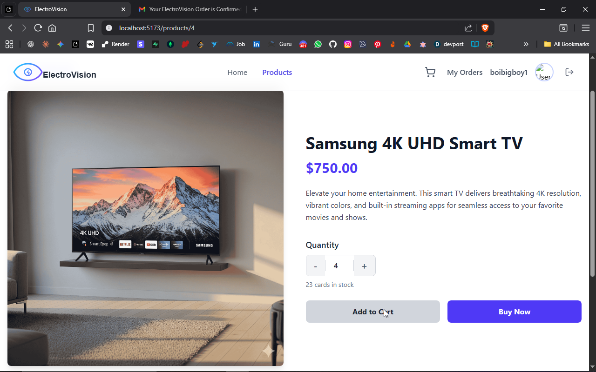
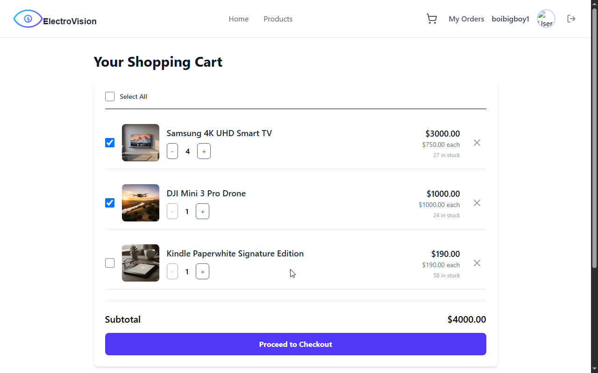
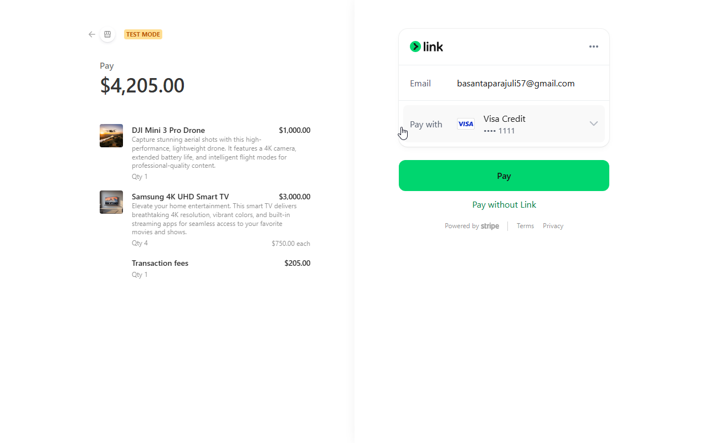
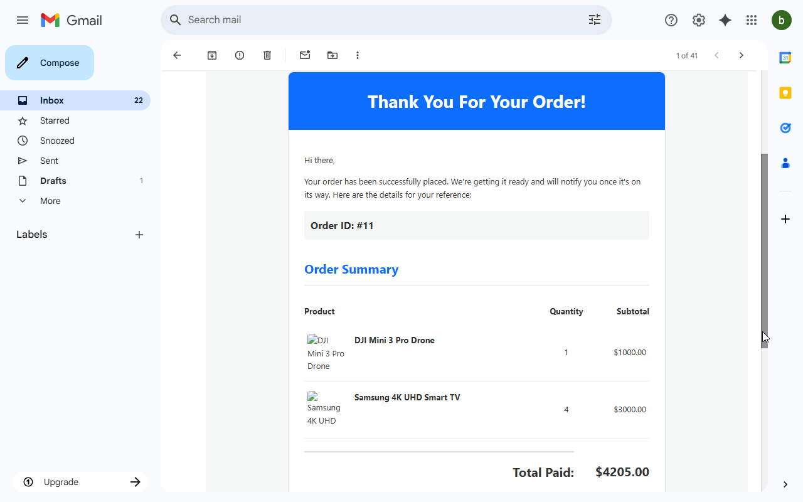
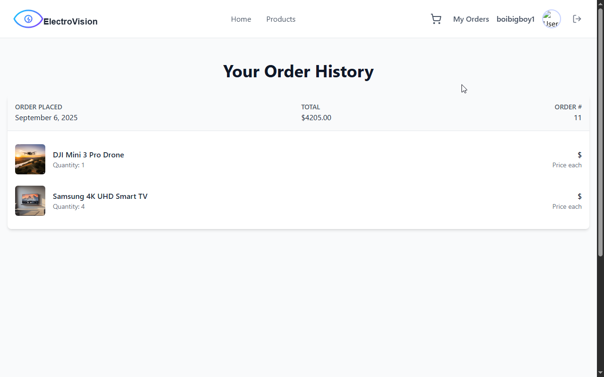

# ElectroVision - Modern E-Commerce Store

ElectroVision is a full-stack e-commerce web application designed for selling electronic products. Users can browse a wide range of electronics, manage their shopping cart, and securely purchase items. After a successful purchase, a detailed order confirmation is sent directly to their email.
 
---

## Showcase

| **Home Page** | **Empty Order History** |
| ------------- | ----------------------- |
|  |  |

| **Products Page** | **Product Detail** |
| ----------------- | ------------------ |
|  |  |

| **Shopping Cart** | **Checkout** |
| ----------------- | ------------ |
|  |  |

| **Email Confirmation** | **Order History** |
| ---------------------- | ----------------- |
|  |  |

---

## Features

-   **Secure Authentication:** User sign-up and login handled securely via Google OAuth 2.0.
-   **Product Catalog:** Browse a catalog of available electronic products like TVs, drones, and e-readers.
-   **Shopping Cart System:** Add multiple products to a cart, select items to purchase, and adjust quantities.
-   **Flexible Purchasing:** Users can either buy a single product instantly with the "Buy Now" option or add multiple items to their cart for a single checkout.
-   **Secure Payments:** Seamless and secure payment processing powered by Stripe.
-   **Order History:** Users can view a history of all their past purchases.
-   **Email Confirmation:** After a successful purchase, users receive an email with their order summary, including products and the total amount.

---

## Tech Stack

| Category           | Technology                                    |
| ------------------ | --------------------------------------------- |
| **Backend**        | Node.js, Express, TypeScript                  |
| **Frontend**       | React, Vite, TypeScript                       |
| **Database**       | PostgreSQL                                    |
| **ORM**            | Drizzle ORM                                   |
| **Authentication** | Passport.js (Google OAuth 2.0 Strategy)       |
| **Payments**       | Stripe                                        |
| **Email**          | Nodemailer                                    |

---

## Getting Started

Follow these instructions to get a copy of the project up and running on your local machine for development and testing purposes.

### Prerequisites

Before you begin, you will need to have the following installed and configured:

-   **Node.js** (v18 or later)
-   **npm** or **yarn**
-   **PostgreSQL** database instance
-   **Stripe Account:** To get your `STRIPE_SECRET_KEY`.
-   **Stripe CLI:** For testing webhooks locally.
-   **Google Cloud Platform Account:** To get your `GOOGLE_CLIENT_ID` and `GOOGLE_CLIENT_SECRET`.
-   **Gmail Account:** With an "App Password" for Nodemailer (`MAIL_USER`, `MAIL_PASS`).

---

### Installation & Setup

**1. Clone the Repository**
```bash
git clone https://github.com/your-username/electrovision.git
cd electrovision
```

**2. Backend Setup**
Navigate to the backend directory (let's assume it's `/backend`).

```bash
cd backend
npm install
```

**3. Environment Variables**
Create a `.env` file in the `/backend` directory by copying the example file.

```bash
cp .env.example .env
```

Now, open the `.env` file and fill it with your credentials:

```ini
# Server Configuration
PORT=5000
SERVER_BASE_URL=http://localhost:5000
FRONTEND_BASE_URL=http://localhost:5173

# Database Credentials
DB_HOST=localhost
DB_PORT=5432
DB_USER=store
DB_PASSWORD=store
DB_NAME=store

# Stripe Keys
STRIPE_SECRET_KEY=sk_test_...
STRIPE_WEBHOOK_SECRET=whsec_...

# Google OAuth Credentials
GOOGLE_CLIENT_ID=...
GOOGLE_CLIENT_SECRET=...

# Session Management
SESSION_SECRET=your_strong_session_secret

# Nodemailer (Gmail) Credentials
MAIL_USER=your-email@gmail.com
MAIL_PASS=your_gmail_app_password
```
> **Note:** For `MAIL_PASS`, you must generate an **App Password** from your Google Account security settings, not your regular login password.

**4. Database Setup**
Run the following commands in order from the `/backend` directory to set up your PostgreSQL database with the required schema and seed data.

```bash
# 1. Generate Drizzle ORM migration files based on your schema
npx drizzle-kit generate --config=src/config/drizzle.config.ts

# 2. Push the schema to your database to create the tables
npx drizzle-kit push --config=./src/config/drizzle.config.ts

# 3. Seed the database with initial products
npm run seed
```

**5. Frontend Setup**
Navigate to the frontend directory (let's assume it's `/frontend`).

```bash
cd ../frontend
npm install
```
*(You may also need a `.env` file in the frontend to point to the backend API URL, e.g., `VITE_API_URL=http://localhost:5000/api`)*

---

## Running the Application

You will need to run three processes in separate terminal windows.

**1. Start the Backend Server**
From the `/backend` directory:
```bash
npm run dev
```> Your backend API will be running on `http://localhost:5000`.

**2. Start the Frontend Development Server**
From the `/frontend` directory:
```bash
npm run dev
```
> Your frontend will be accessible at `http://localhost:5173`.

**3. Start the Stripe CLI for Webhooks**
To process payment events locally, run:
```bash
stripe listen --forward-to http://localhost:5000/api/stripe/webhook
```
> This command will give you a webhook secret (`whsec_...`). Copy this secret and place it in your backend `.env` file as the `STRIPE_WEBHOOK_SECRET`.

You can now open your browser to `http://localhost:5173` and use the application.

## Available Scripts

Here is a list of useful scripts from `package.json` in the `/backend` directory:

| Script       | Description                                              |
| ------------ | -------------------------------------------------------- |
| `npm run dev`      | Starts the backend server in development mode.           |
| `npm run seed`     | Populates the database with initial product data.      |
| `npm run del`      | Clears all products from the database.                  |
| `npm run del2`     | **Warning:** Clears all data from all tables.           |

## License

This project is licensed under the MIT License.